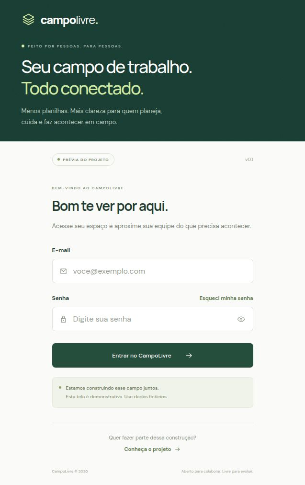

# CampoLivre

Projeto colaborativo de gestão de manutenção e equipes de campo para empresas de diferentes setores. O CampoLivre tem marca própria e não é um sistema exclusivo de uma empresa. Esta primeira entrega contém a estrutura do frontend e uma página de login responsiva para apresentação ao grupo.

Consulte o [plano do projeto](docs/plano-do-projeto.md) para conhecer os requisitos previstos para as próximas etapas.

## Prévia do login



Interface demonstrativa, ainda sem autenticação real.

## Executar

Use Node.js 22.12 ou superior e npm.

```sh
npm install
npm run dev
```

Abra http://localhost:5173. Para validar a entrega:

```sh
npm run typecheck
npm run build
npm run preview
```

O frontend usa React, TypeScript e [Vite](https://vite.dev/guide/). `package-lock.json` fixa as dependências; depois da instalação inicial, use `npm ci` para instalações reproduzíveis.

## Estrutura

```text
public/                 Ícone e arquivos públicos
src/
  app/                  Composição da aplicação
  components/           Componentes compartilhados
  features/auth/        Página de login e sua ilustração
  styles/               Estilos globais e responsividade
docs/                   Orientações e decisões do projeto
.scratch/campo-livre/    Histórico da entrevista e escopo
```

## Limites desta apresentação

O login valida os campos no navegador e apresenta uma mensagem sobre a prévia. Não há autenticação, contas, backend, persistência de credenciais ou envio dos campos. Use dados fictícios. Recuperação de senha e participação no projeto exibem informações, sem integrações externas. As fontes vêm do Google Fonts, com fontes locais de fallback.

A planta industrial é uma ilustração fictícia, ainda sem interação. Mapa interativo, modo TV, painel do supervisor e fluxo do técnico fazem parte da direção futura, não desta entrega. Não há vínculo institucional confirmado com a CSN.

## Colaboração

Consulte [a organização dos mantenedores](docs/governanca.md) e o [vocabulário do projeto](CONTEXT.md). O processo atual é organizado em planilhas; a direção do produto é dar ao supervisor planejamento e acompanhamento e ao técnico consulta e registro de execução.
